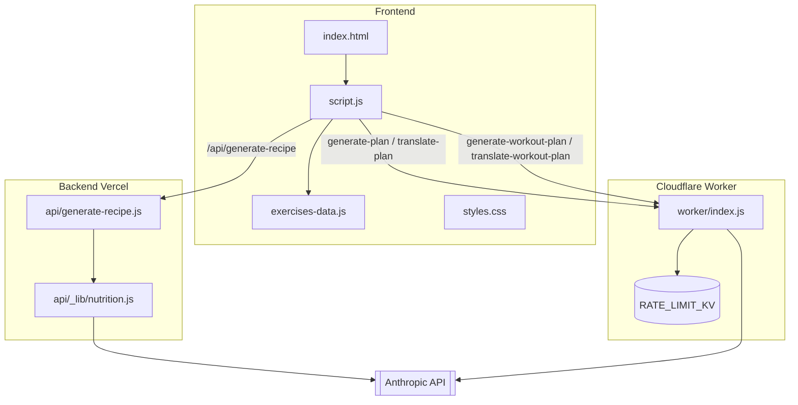

# Arhitectură — FF Fitness

Aplicație web statică (RO/EN) cu trei funcționalități: calculator TDEE/BMR, generator de plan alimentar AI (7 zile) cu rețete și export PDF, și un catalog de exerciții cu hartă corporală interactivă + generator de plan de antrenament AI. Fără framework sau build step — HTML/CSS/JS vanilla, susținut de **două** backend-uri serverless separate.

## Cuprins

1. [Frontend — site static](#1-frontend--site-static)
2. [Backend Vercel — generare rețete](#2-backend-vercel--generare-rețete)
3. [Backend Cloudflare Worker — plan alimentar & antrenament](#3-backend-cloudflare-worker--plan-alimentar--antrenament)
4. [Fluxuri cheie](#4-fluxuri-cheie)
5. [Topologie de deployment](#5-topologie-de-deployment)
6. [Unelte Claude Code din acest repo](#6-unelte-claude-code-din-acest-repo)
7. [Fișiere neconectate la aplicație](#7-fișiere-neconectate-la-aplicație)

---

## 1. Frontend — site static

Site static, fără framework și fără build step: HTML/CSS/JS vanilla, servit ca atare de Vercel.

- **`index.html`** — shell-ul SPA. Trei `.view`-uri comutate prin `data-view` (`calculator`, `exercises`, `faq`), toggle limbă RO/EN, harta corporală SVG (`#bodymap-front` / `#bodymap-back`) cu comutare Față/Spate.
- **`script.js`** — toată logica aplicației (~2570 linii). Secțiuni principale:
  - dicționar de traduceri `CONTENT` + `applyLanguage()` (i18n RO/EN, persistat în `localStorage`)
  - calculator BMR/TDEE/macro-uri (100% client-side)
  - navigare (`showView`, hamburger, accordion FAQ)
  - harta corporală + listă exerciții, citește din `exercises-data.js`
  - plan alimentar AI → apelează [Cloudflare Worker](#3-backend-cloudflare-worker--plan-alimentar--antrenament)
  - rețete AI + export PDF (jsPDF vendorizat în `assets/vendor/`) → apelează [Backend Vercel](#2-backend-vercel--generare-rețete)
  - plan de antrenament AI → apelează [Cloudflare Worker](#3-backend-cloudflare-worker--plan-alimentar--antrenament)
  - **fallback local**: dacă fetch-ul eșuează (ex. rulare pe `file://`), generează plan/rețetă fără AI, din date hardcodate
- **`exercises-data.js`** — catalogul static de exerciții: `MUSCLE_GROUPS` (12 grupe) + `EXERCISES` (~48 obiecte `{id, muscleGroup, name, description, sets, reps, equipment, difficulty, videoId}`). Este **duplicat manual** ca `EXERCISE_CATALOG` în Worker, ca AI-ul să nu inventeze exerciții inexistente pe site.
- **`styles.css`** — variabile CSS pentru culori/spațiere, font Oswald self-hosted, temă dark.

## 2. Backend Vercel — generare rețete

Funcție serverless pe Vercel, singura responsabilitate: generarea AI a rețetelor pentru mesele din planul alimentar.

- **`api/generate-recipe.js`** — `POST /api/generate-recipe`, apelată din `script.js` (`fetchRecipeFromApi`) printr-un URL relativ. Validează payload-ul (`{name, description, kcal, protein, carbs, fat}`), cere `ANTHROPIC_API_KEY` din env (403/503 dacă lipsește), cheamă `callClaude()`.
- **`api/_lib/nutrition.js`** — schema JSON pentru rețete/plan, prompt builders (`buildRecipeSystemPrompt`, `buildRecipeUserMessage`), `callClaude()` — apel către `https://api.anthropic.com/v1/messages`, `model: claude-sonnet-5`, output structurat (`json_schema`).
- **`vercel.json`** — `functions["api/generate-recipe.js"].maxDuration = 30`. Limita de execuție Vercel e motivul pentru care planul alimentar/antrenament (mult mai lent, streamed) a fost mutat pe Cloudflare Worker (vezi commit `9149383`). Rețetele au rămas aici fiindcă sunt rapide.

## 3. Backend Cloudflare Worker — plan alimentar & antrenament

Worker unic (`worker/index.js`, ~950 linii) care găzduiește tot ce durează prea mult pentru limita de execuție Vercel: planul alimentar de 7 zile, planul de antrenament AI și traducerile lor.

| Rută | Scop |
|---|---|
| `POST /api/generate-plan` | plan alimentar 7 zile, streamed NDJSON |
| `POST /api/generate-recipe` | duplicat al backend-ului Vercel, neapelat de frontend |
| `POST /api/translate-plan` | traduce planul alimentar generat |
| `POST /api/generate-workout-plan` | plan de antrenament AI, streamed NDJSON, cu cache + rate limit |
| `POST /api/translate-workout-plan` | traduce planul de antrenament |

**Mecanisme cheie:**

- **Rate limiting** — per `kind:ip:oră`, în KV `RATE_LIMIT_KV`. Limite: plan 8/h, rețetă 30/h, traducere plan 20/h, antrenament 20/h, traducere antrenament 20/h. Fail-open dacă KV nu e legat.
- **Cache pool plan de antrenament** — până la 5 variante pre-generate per combinație `lang:goal:days:equipment:experience`, TTL 30 zile, servite random la cache-hit. Ocolit dacă utilizatorul cere explicit regenerare sau are text liber cu accidentări (`injuriesText`).
- **Cache pool plan alimentar** — până la 12 variante per combinație `lang:goal:kcal±100:protein±10:carbs±10:fat±7.5:alergii:magazine` (bucket-uri late, deliberat, ca să crească rata de cache-hit), TTL 30 zile. Ocolit doar dacă userul a completat câmpul liber de preferințe (`dislikeText`) — apăsarea „Regenerează" NU mai forțează un apel AI nou: clientul trimite semnătura planului curent (`excludeSignature`, nume de mese) și serverul întoarce o altă variantă din pool dacă există una diferită, altfel generează live și o adaugă în pool.
- **Streaming** — răspunsul SSE de la Anthropic e parsat live (`makeDayExtractor`) și fiecare zi din plan e trimisă către client imediat ce e completă, ca NDJSON.
- **`EXERCISE_CATALOG`** — copie manuală, hardcodată, a datelor din `exercises-data.js`, folosită ca `enum` în schema JSON ca AI-ul să aleagă doar exerciții care există efectiv pe site (cu video demo).
- **`worker/wrangler.toml`** — leagă namespace-ul KV `RATE_LIMIT_KV`; `ANTHROPIC_API_KEY` e secret Wrangler (`wrangler secret put`), nu apare în fișier.
- **Dependențe** — `wrangler` e singura dependență directă (dev); restul din `worker/node_modules` sunt uneltele lui interne de build/deploy (esbuild, workerd, miniflare etc.), nu cod folosit de `worker/index.js`.

## 4. Fluxuri cheie

1. **Calculator TDEE/BMR** — 100% client-side, fără backend.
2. **Plan alimentar AI** → `script.js` (`fetchPlanFromApi`) → Worker `/api/generate-plan` (streaming) → Anthropic API. Traducerea ulterioară RO⇄EN → `/api/translate-plan`.
3. **Rețetă AI** (dintr-un meal din plan) → `script.js` (`fetchRecipeFromApi`) → Vercel `/api/generate-recipe` → Anthropic API. Poate fi exportată ca PDF client-side.
4. **Plan de antrenament AI** → `script.js` (`fetchWorkoutPlanFromApi`) → Worker `/api/generate-workout-plan` (verifică `RATE_LIMIT_KV`, încearcă cache pool, altfel generează + salvează în pool) → Anthropic API.
5. **Eșec rețea** (orice fetch) → cad pe generatoare locale în `script.js`, fără AI.

## 5. Topologie de deployment

- **Site static + funcții** → Vercel (implicit, din `vercel.json`, fără rewrites explicite — Vercel rutează `api/*.js` automat).
- **Worker** → Cloudflare, deploy separat via `wrangler deploy`, domeniu `ff-fitness-nutrition.iarisgabor.workers.dev`.
- Cele două backend-uri sunt **complet independente** — fără proxy comun. CORS pe Worker (`corsHeaders`, reflectă `Origin`) permite paginii de pe Vercel să-l apeleze cross-origin.
- **Cod duplicat, nu partajat**, între `api/_lib/nutrition.js` și `worker/index.js` — aceleași scheme JSON și prompt-uri, întreținute manual în două locuri. De reținut la orice modificare a formatului de plan/rețetă.
- Secrete: `ANTHROPIC_API_KEY` setat separat ca variabilă de mediu Vercel și ca secret Wrangler pe Cloudflare.

## 6. Unelte Claude Code din acest repo

Acest folder mai conține și un agent și patru skill-uri custom pentru Claude Code, complet separate de produsul FF Fitness:

- **Agent `Show-score`** (`.claude/agents/Show-score.md`) — Haiku 4.5 + WebSearch, spune scorul FC Barcelona la cerere.
- **Skill `afaceri-locale-ro`** — compilează un director de afaceri publice din România din date OpenStreetMap, exportat ca CSV.
- **Skill `website-afaceri-ro`** — generează un site de o pagină pentru o afacere locală, fie descrisă direct, fie în lot din CSV-ul de la `afaceri-locale-ro`. Alege culori/fonturi per industrie, randează HTML cu Jinja2.
- **Skill `emag-cauta`** — caută un produs pe eMag.ro, compară după preț și recenzii.
- **Skill `pret-carte-ro`** — caută prețul unei cărți în librăriile online din România.

Flux tipic: `afaceri-locale-ro` → CSV cu afaceri dintr-o categorie/localitate → `website-afaceri-ro` citește CSV-ul, generează context JSON per afacere și randează site-ul din `templates/site.html.j2` → rezultatul ajunge în `rezultate/`.

## 7. Fișiere neconectate la aplicație

- **`player.gd`** — script Godot 4 (`CharacterBody2D`, mișcare 4-direcțională + stare walk/idle). Trecut în `.gitignore`, netracked. Zero referințe la Godot în frontend. Rămășiță reală, orfană, dintr-un alt proiect (joc).
- **`test/index.html`** — nu e un test al aplicației FF Fitness. E un landing page pentru o clinică dentară fictivă ("Clinică Dentară Privată — Oradea"), netracked de git. **Nu e chiar orfan**: conținut tematic identic cu rezultatul oficial al skill-ului `website-afaceri-ro` din `.claude/skills/website-afaceri-ro/rezultate/dentisti_Municipiul-Oradea_2026-08-15/clinica-dentara-privata.html` (CSS diferit, versiune mai veche) — pare un prototip/test al aceluiași skill, dinainte să existe convenția de folder `rezultate/`.
