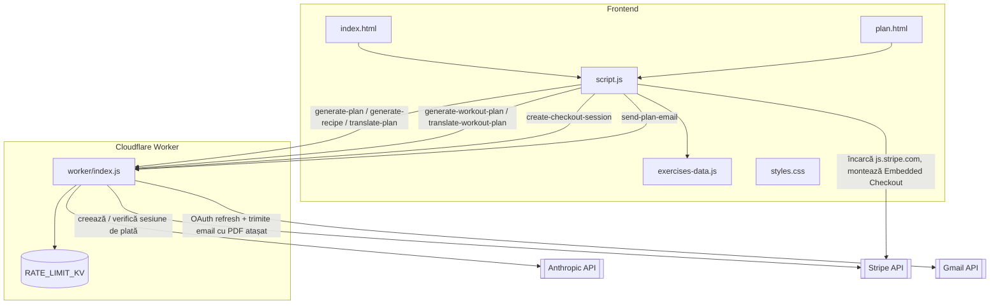

# Arhitectură — FF Fitness

Aplicație web statică (RO/EN) cu trei funcționalități: calculator TDEE/BMR, generator de plan alimentar AI (7 zile, **taxat $5/plan** prin Stripe, pe o pagină separată — `plan.html`) cu rețete complete (cache-uite server-side), export PDF (per rețetă și pentru tot planul) și trimitere pe email, și un catalog de exerciții cu hartă corporală interactivă + generator de plan de antrenament AI (gratuit). Fără framework sau build step — HTML/CSS/JS vanilla, servit integral static (Vercel n-are nicio funcție serverless), susținut de **un singur** backend: un Cloudflare Worker.

## Cuprins

1. [Frontend — site static](#1-frontend--site-static)
2. [Backend Cloudflare Worker](#2-backend-cloudflare-worker)
3. [Fluxuri cheie](#3-fluxuri-cheie)
4. [Topologie de deployment](#4-topologie-de-deployment)
5. [Unelte Claude Code din acest repo](#5-unelte-claude-code-din-acest-repo)
6. [Fișiere neconectate la aplicație](#6-fișiere-neconectate-la-aplicație)

Redirect-ul de finalizare a plății (Stripe → `return_url` = `plan.html?session_id=...`, pe propriul domeniu) e o navigare de browser, nu un apel API — nereprezentată ca muchie separată în diagramă.

---

## 1. Frontend — site static

Site static, fără framework și fără build step: HTML/CSS/JS vanilla, servit ca atare de Vercel (doar fișiere statice — zero funcții serverless).

- **`index.html`** — shell-ul SPA pentru calculator/exerciții/FAQ. Trei `.view`-uri comutate prin `data-view` (`calculator`, `exercises`, `faq`), toggle limbă RO/EN, harta corporală SVG (`#bodymap-front` / `#bodymap-back`) cu comutare Față/Spate. După calcul, arată doar cardul de plată (`.plan-paywall-card`) pentru planul alimentar AI — fără formular de alergii/magazine și fără rezultatul planului, mutate pe `plan.html`.
- **`plan.html`** — pagină separată, `<body data-page="plan">`, accesibilă doar după plată. Trei stări posibile (`hidden`, comutate de `updatePlanPageState()`): fără sesiune plătită cunoscută (locked), sesiune plătită dar fără targeturi de calculator în acest browser (missing-results — ex. link-ul de plată deschis pe alt dispozitiv), sau ambele prezente (ready — formular alergii/magazine + generare + rezultat, mutate verbatim de pe `index.html`). Header/footer identice vizual cu `index.html`, dar navigarea e prin `<a href="index.html">` simple (nu `data-view` — sistemul acela există doar pe `index.html`). Găzduiește și modalul de rețetă (`#recipe-modal`, mutat aici — recipele sunt accesibile doar dintr-un plan generat) și o copie a modalului de plată (`#payment-modal` — necesar și aici, pentru cazul în care userul schimbă configurația și trebuie să replătească, direct de pe această pagină).
- **`script.js`** — toată logica aplicației, un singur fișier, încărcat de ambele pagini HTML. `init()` e dependent de pagină (`document.body.dataset.page`) — pornește doar inițializatorii relevanți paginii curente. Secțiuni principale:
  - dicționar de traduceri `CONTENT` + `applyLanguage()` (i18n RO/EN, persistat în `localStorage`) — sigur de apelat pe ambele pagini (funcțiile care ating DOM specific unei singure pagini își gardează accesul, ex. `renderResults()`, `setBodymapCaption()`, `updateExerciseListBackLabel()`)
  - calculator BMR/TDEE/macro-uri (100% client-side, pe `index.html`) — rezultatul (`lastResults`) e persistat în `localStorage`, nu doar în memorie, ca `plan.html` să aibă targeturile disponibile la orice vizită, nu doar imediat după revenirea de la Stripe
  - navigare (`showView`, hamburger, accordion FAQ) — doar pe `index.html`
  - harta corporală + listă exerciții, citește din `exercises-data.js` — doar pe `index.html`
  - plan alimentar AI, **taxat $5/plan** → gate de plată Stripe Embedded Checkout pe `index.html`, apoi formular + generare + rețete + export PDF + email pe `plan.html` → apelează [Worker](#2-backend-cloudflare-worker) (vezi flux #2 mai jos)
  - rețete AI (cache-first pe Worker) + export PDF per rețetă și pentru tot planul (jsPDF vendorizat în `assets/vendor/`) + trimitere pe email a planului complet (PDF atașat, trimis prin Gmail API, de pe contul Gmail al site-ului)
  - plan de antrenament AI → apelează [Worker](#2-backend-cloudflare-worker) — neschimbat, gratuit
  - **fallback local**: dacă fetch-ul eșuează (ex. rulare pe `file://`), generează plan/rețetă fără AI, din date hardcodate
- **`exercises-data.js`** — catalogul static de exerciții: `MUSCLE_GROUPS` (12 grupe) + `EXERCISES` (~48 obiecte `{id, muscleGroup, name, description, sets, reps, equipment, difficulty, videoId}`). Este **duplicat manual** ca `EXERCISE_CATALOG` în Worker, ca AI-ul să nu inventeze exerciții inexistente pe site. Încărcat doar de `index.html` (nimic din `plan.html` are nevoie de el).
- **`styles.css`** — variabile CSS pentru culori/spațiere, font Oswald self-hosted, temă dark. Un singur fișier, aceleași selectoare, folosit de ambele pagini HTML — nicio scopare per-pagină.

## 2. Backend Cloudflare Worker

Worker unic (`worker/index.js`) care găzduiește tot ce durează prea mult sau are nevoie de KV (cache, rate limiting, taxare): planul alimentar de 7 zile, rețetele individuale, planul de antrenament AI, traducerile lor, plata Stripe și trimiterea de email.

| Rută | Scop |
|---|---|
| `POST /api/generate-plan` | plan alimentar 7 zile, streamed NDJSON — **taxat**, cere `paymentSessionId` valid |
| `POST /api/create-checkout-session` | creează o sesiune Stripe Checkout embedded ($5, USD) pentru planul alimentar |
| `POST /api/send-plan-email` | trimite planul complet ca PDF atașat, prin Gmail API — **taxat** (reverifică plata), cu plafon de trimiteri per sesiune |
| `POST /api/generate-recipe` | rețetă individuală AI — **cache-first prin KV**; migrat de pe Vercel (avea nevoie de KV pentru cache, indisponibil pe funcții Vercel) |
| `POST /api/translate-plan` | traduce planul alimentar generat |
| `POST /api/generate-workout-plan` | plan de antrenament AI, streamed NDJSON, cu cache + rate limit |
| `POST /api/translate-workout-plan` | traduce planul de antrenament |

**Mecanisme cheie:**

- **Rate limiting** — per `kind:ip:oră`, în KV `RATE_LIMIT_KV`. Limite: plan 8/h, rețetă 30/h, checkout 20/h, email 5/h, traducere plan 20/h, antrenament 20/h, traducere antrenament 20/h. Fail-open dacă KV nu e legat.
- **Cache pool plan de antrenament** — până la 5 variante pre-generate per combinație `lang:goal:days:equipment:experience`, TTL 30 zile, servite random la cache-hit. Ocolit dacă utilizatorul cere explicit regenerare sau are text liber cu accidentări (`injuriesText`).
- **Cache pool plan alimentar** — până la 12 variante per combinație `lang:goal:kcal±100:protein±10:carbs±10:fat±7.5:alergii:magazine` (bucket-uri late, deliberat, ca să crească rata de cache-hit), TTL 30 zile. Ocolit doar dacă userul a completat câmpul liber de preferințe (`dislikeText`) — apăsarea „Regenerează" NU mai forțează un apel AI nou: clientul trimite semnătura planului curent (`excludeSignature`, nume de mese) și serverul întoarce o altă variantă din pool dacă există una diferită, altfel generează live și o adaugă în pool.
- **Cache rețete individuale** — cheie = hash SHA-256 (`crypto.subtle`, nativ) din `name.en + description.en + macro-uri rotunjite` (deliberat fără magazine — rețeta nu depinde de ele în prompt), TTL = același `PLAN_CACHE_TTL_SECONDS`. Motivație: planurile deja se repetă între utilizatori (pool-ul de mai sus), deci și mesele lor se repetă — cache-uirea rețetelor per masă (nu per plan) evită un apel AI la fiecare vizualizare/export a aceleiași mese, indiferent din ce plan vine.
- **Pre-generare eagră în fundal** (`pregenerateRecipesForPlan`, via `ctx.waitUntil()`) — când un plan nou (niciodată văzut) e adăugat în pool, Worker-ul pornește în fundal generarea rețetelor lipsă pentru toate mesele lui, fără să întârzie răspunsul deja trimis userului. `waitUntil()` are un plafon propriu de ~30s — acoperire completă la un singur apel NU e garantată (deliberat fără batching/chunking, care ar înrăutăți lucrurile), dar pe termen sistemic majoritatea meselor circulante ajung cache-uite. Ce nu apucă rămâne cache-miss, preluat mai târziu de generarea live-la-cerere.
- **Streaming** — răspunsul SSE de la Anthropic e parsat live (`makeDayExtractor`) și fiecare zi din plan e trimisă către client imediat ce e completă, ca NDJSON.
- **`EXERCISE_CATALOG`** — copie manuală, hardcodată, a datelor din `exercises-data.js`, folosită ca `enum` în schema JSON ca AI-ul să aleagă doar exerciții care există efectiv pe site (cu video demo).
- **Gate de plată planul alimentar** (`verifyPaidEntitlement`) — la fiecare `POST /api/generate-plan` și `POST /api/send-plan-email`, se verifică *live* la Stripe (`GET /v1/checkout/sessions/{id}`) că `paymentSessionId`-ul trimis de client are `payment_status: 'paid'` — niciodată încredere într-un flag trimis de client. Sesiunea plătită se leagă apoi, în `RATE_LIMIT_KV` (cheie `paid_session:{sessionId}`, TTL 30 zile), de `buildPlanCacheKey(body)` — aceeași semnătură de bucket folosită de cache pool-ul de mai sus, refolosită direct ca identificator de "configurație plătită". Prima utilizare a unei sesiuni plătite leagă semnătura; utilizările ulterioare (regenerare, export, email) trec gratuit doar dacă cererea are aceeași semnătură — o configurație diferită (alte ținte de calorii/macro) cere o plată nouă. Verificarea rulează **înainte** de citirea din cache pool — altfel un vizitator neplătitor ar putea primi gratis planul altcuiva dintr-un bucket popular. Spre deosebire de `checkRateLimit()`, acest gate e **fail-closed**: dacă `RATE_LIMIT_KV` sau `STRIPE_SECRET_KEY` lipsesc, cererea e respinsă (503), niciodată lăsată să treacă gratis. Înregistrarea din KV mai ține și `emailsSent` (plafon 5 trimiteri per sesiune plătită, incrementat doar la trimitere reușită).
- **Trimitere email prin Gmail API, cu OAuth2** (`getGmailAccessToken`, `sendGmailEmail`, `buildGmailMimeMessage`) — Worker-ul ține un refresh token permanent (`GMAIL_REFRESH_TOKEN`, obținut o singură dată, manual, prin autorizarea contului Gmail al site-ului) și, la fiecare trimitere, îl schimbă pe un access token de scurtă durată (`POST https://oauth2.googleapis.com/token`), apoi apelează `POST .../gmail/v1/users/me/messages/send` cu mesajul MIME (text + PDF atașat) construit manual și codat base64url. Niciun token de acces nu e cache-uit — volumul (plafonat la 5 emailuri/oră/IP, 5/sesiune plătită) nu justifică asta.
- **`worker/wrangler.toml`** — leagă doar namespace-ul KV `RATE_LIMIT_KV`. `ANTHROPIC_API_KEY`, `STRIPE_SECRET_KEY`, `GMAIL_CLIENT_ID`, `GMAIL_CLIENT_SECRET`, `GMAIL_REFRESH_TOKEN`, `GMAIL_FROM_ADDRESS` sunt secrete Wrangler (`wrangler secret put`), nu apar în fișier.
- **Dependențe** — `wrangler` e singura dependență directă (dev); restul din `worker/node_modules` sunt uneltele lui interne de build/deploy (esbuild, workerd, miniflare etc.), nu cod folosit de `worker/index.js`. Stripe, Gmail și Anthropic sunt apelate identic — fără SDK, direct prin `fetch()` (`stripeRequest()`, `getGmailAccessToken()`/`sendGmailEmail()`, `callClaude()`).

## 3. Fluxuri cheie

1. **Calculator TDEE/BMR** — 100% client-side, pe `index.html`, fără backend. Rezultatul e persistat în `localStorage`.
2. **Plan alimentar AI, taxat $5** → pe `index.html`, dacă browserul n-are o sesiune plătită cunoscută, click pe CTA deschide direct modalul de plată (`openPaymentModal`): `script.js` cere Worker-ului `/api/create-checkout-session`, montează Stripe Embedded Checkout în modal. La finalul plății, Embedded Checkout navighează întreaga pagină către `return_url` = `plan.html?session_id=...` (construit server-side din header-ul `Origin`). Pe `plan.html`, `initPlanPageArrival()` preia `session_id`-ul din URL, îl curăță, și arată formularul de alergii/magazine (pre-completat din `localStorage`) — userul alege activ și apasă Generează (nimic automat). De aici încolo: `script.js` (`fetchPlanFromApi`) → Worker `/api/generate-plan` (streaming), verificat server-side prin `verifyPaidEntitlement` → Anthropic API. Traducerea ulterioară RO⇄EN → `/api/translate-plan` (nu e taxată separat — operează pe un plan deja plătit).
3. **Rețetă AI** (dintr-un meal din plan, pe `plan.html`) → `script.js` (`fetchRecipeFromApi`) → Worker `/api/generate-recipe` (cache-first prin KV) → Anthropic API doar la cache-miss. Poate fi exportată ca PDF client-side.
4. **Export PDF plan complet** → `ensureAllRecipesLoaded()` se asigură întâi că fiecare masă din plan are rețeta în `recipeCache` (din cache server, sau live la nevoie), apoi `buildPlanPdf()` construiește documentul (toate zilele, toate mesele, rețete complete).
5. **Trimitere plan pe email** → aceeași pregătire ca la export (`ensureAllRecipesLoaded` + `buildPlanPdf`), apoi PDF-ul (base64) + `paymentSessionId` merg către Worker `/api/send-plan-email`, care reverifică plata (`verifyPaidEntitlement`), obține un access token Gmail proaspăt din refresh token-ul salvat, construiește mesajul MIME (text + PDF atașat) și îl trimite prin Gmail API — sosește în inbox-ul destinatarului direct de pe contul Gmail al site-ului, nu de la un serviciu terț.
6. **Plan de antrenament AI** → `script.js` (`fetchWorkoutPlanFromApi`) → Worker `/api/generate-workout-plan` (verifică `RATE_LIMIT_KV`, încearcă cache pool, altfel generează + salvează în pool) → Anthropic API.
7. **Eșec rețea** (orice fetch) → cad pe generatoare locale în `script.js`, fără AI — dar niciodată pentru un răspuns 402/403 de la `/api/generate-plan` (plată necesară/nepotrivită), tratat explicit distinct, ca să nu devină un ocol accidental și gratuit al paywall-ului.

## 4. Topologie de deployment

- **Site static** → Vercel (implicit, din `vercel.json` gol — fără rewrites, fără funcții). `index.html` și `plan.html` sunt ambele fișiere statice de top-level, servite direct.
- **Worker** → Cloudflare, deploy separat via `wrangler deploy`, domeniu `ff-fitness-nutrition.iarisgabor.workers.dev`. CORS (`corsHeaders`, reflectă `Origin`) permite paginilor de pe Vercel să-l apeleze cross-origin.
- **Trimiterea de email necesită o autorizare OAuth2 manuală, o singură dată, pe contul Gmail al site-ului** — un proiect Google Cloud cu Gmail API activat, credențiale OAuth (`GMAIL_CLIENT_ID`/`GMAIL_CLIENT_SECRET`), și un refresh token obținut prin login manual în browser (scope `gmail.send`) — o precondiție operațională separată de deploy-ul de cod, nerezolvată automat doar prin `wrangler deploy`. Refresh token-ul e permanent (nu expiră din uz, doar dacă e revocat manual sau contul stă complet neautorizat >6 luni în modul de testare al proiectului Google Cloud).
- Secrete, toate ca secrete Wrangler (`wrangler secret put`), doar pe Cloudflare: `ANTHROPIC_API_KEY`, `STRIPE_SECRET_KEY`, `GMAIL_CLIENT_ID`, `GMAIL_CLIENT_SECRET`, `GMAIL_REFRESH_TOKEN`, `GMAIL_FROM_ADDRESS` (adresa Gmail folosită ca expeditor). `STRIPE_PUBLISHABLE_KEY` e intenționat inline în `script.js` — nu e secret.
- Nu există niciun endpoint de webhook Stripe în acest design — verificarea plății e sincronă, la fiecare cerere relevantă (`/api/generate-plan`, `/api/send-plan-email`).

## 5. Unelte Claude Code din acest repo

Acest folder mai conține și un agent și patru skill-uri custom pentru Claude Code, complet separate de produsul FF Fitness:

- **Agent `Show-score`** (`.claude/agents/Show-score.md`) — Haiku 4.5 + WebSearch, spune scorul FC Barcelona la cerere.
- **Skill `afaceri-locale-ro`** — compilează un director de afaceri publice din România din date OpenStreetMap, exportat ca CSV.
- **Skill `website-afaceri-ro`** — generează un site de o pagină pentru o afacere locală, fie descrisă direct, fie în lot din CSV-ul de la `afaceri-locale-ro`. Alege culori/fonturi per industrie, randează HTML cu Jinja2.
- **Skill `emag-cauta`** — caută un produs pe eMag.ro, compară după preț și recenzii.
- **Skill `pret-carte-ro`** — caută prețul unei cărți în librăriile online din România.

Flux tipic: `afaceri-locale-ro` → CSV cu afaceri dintr-o categorie/localitate → `website-afaceri-ro` citește CSV-ul, generează context JSON per afacere și randează site-ul din `templates/site.html.j2` → rezultatul ajunge în `rezultate/`.

## 6. Fișiere neconectate la aplicație

- **`player.gd`** — script Godot 4 (`CharacterBody2D`, mișcare 4-direcțională + stare walk/idle). Trecut în `.gitignore`, netracked. Zero referințe la Godot în frontend. Rămășiță reală, orfană, dintr-un alt proiect (joc).
- **`test/index.html`** — nu e un test al aplicației FF Fitness. E un landing page pentru o clinică dentară fictivă ("Clinică Dentară Privată — Oradea"), netracked de git. **Nu e chiar orfan**: conținut tematic identic cu rezultatul oficial al skill-ului `website-afaceri-ro` din `.claude/skills/website-afaceri-ro/rezultate/dentisti_Municipiul-Oradea_2026-08-15/clinica-dentara-privata.html` (CSS diferit, versiune mai veche) — pare un prototip/test al aceluiași skill, dinainte să existe convenția de folder `rezultate/`.
